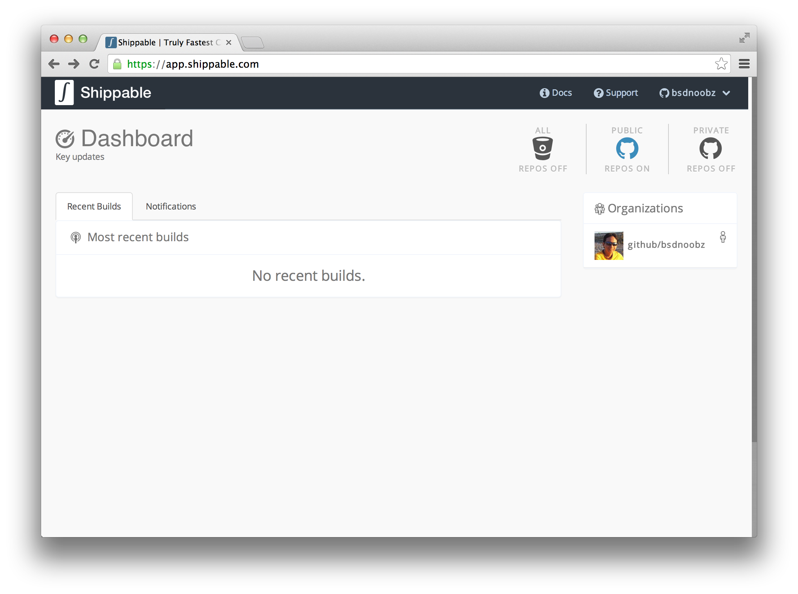
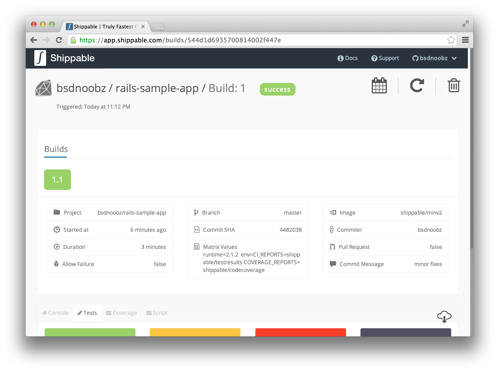

Getting Started with Shippable
==============================

Introduction
------------

**Shippable** is a SaaS platform that lets you easily add Continuous Integration/Deployment to your Github and BitButcket (git) repositories. It is lightweight, super simple to setup, and runs your builds and tests faster than any other service. After building and teting your code, you can deploy it to any PaaS provider like Heroku & OpenShift and also to VMs, bare metal, OpenStack clusters, or any major infrastructure provider.

Shippable uses **Build Minions** which is docker based containers to run your workloads. Docker is the fastest growing Linux container solution and this will light up some cool scenarios like portability and versioning in the coming weeks.

Shippable supports many popular languages such as Ruby, Python, Node.js, and others. We also support services which are commonly used in your applications like MySQL, PostgreSQL, Elastic Search, and others.

Common use cases for Shippable include:

- Automating the packaging and deployment of web applications.
- Automated testing and continuous integration/deployment.

.. note:: Shippable is 100% free to use, even for private repositories.

In this guide, you will learn how to use Shippable for automated testing and then deploy your web application to Heroku if the tests are passed. We will be using Ruby on Rails app in this guide, but you can easily use this guide for other frameworks/languanges as well.

This tutorial assumes that you have:

- A free `Github account <https:/github.com>`_.
- A free `Shippable account <http://www.shippable.com>`_.
- A free `Heroku account <https://signup.heroku.com/signup/dc>`_.
- Ruby on Rails installed your system.

Prepare your app
----------------

We have created a sample `Ruby on Rails application <https://github.com/bsdnoobz/rails-sample-app>`_ on Github for this guide. First you need to `fork the sample code <https://help.github.com/articles/fork-a-repo/>`_ to your Github account and then create a clone to work locally on your computer.

::

    $ git clone git@github.com:YOUR-USERNAME/rails-sample-app.git

We will assume that the repository is in the ``~/rails-sample-app`` directory.

The app is a simple Ruby on Rails project which was generated using the `rails generate scaffold` command. Before doing something with the app, take a look and play around with the app on your computer first. Run the following commands from your terminal::

    $ cd ~/rails-sample-app
    $ bundle install --without production
    $ rake db:migrate
    $ rake test
    $ rails server

Visit the app by opening ``http://localhost:3000`` from your browser.

Create remote repository on Heroku
----------------------------------

In this step you will create a remote repository on Heroku (i.e. deploy the app) using `Heroku toolbelt <https://toolbelt.heroku.com/>`_. Please download and install the tool if you haven't installed it on your computer. Refer to the documentation for the detailed explanation on how to use the tool.

Change to the sample app's directory and create a remote repository::

    $ cd ~/rails-sample-app
    $ heroku create
    Creating fathomless-ocean-2995... done, stack is cedar
    https://fathomless-ocean-2995.herokuapp.com/ | git@heroku.com:fathomless-ocean-2995.git
    Git remote heroku added

The command ``heroku create`` will creates a remote repository (called ``heroku``) which it configures in your local git repo. It also set a random name for your app (in this case ``fathomless-ocean-2995``) and the URL to access your app (``https://fathomless-ocean-2995.herokuapp.com/``). Note that the name will be different on your computer.

Deploy the app::

    $ git push heroku master
    Initializing repository, done.
    Counting objects: 117, done.
    Delta compression using up to 4 threads.
    Compressing objects: 100% (91/91), done.
    Writing objects: 100% (117/117), 23.30 KiB | 0 bytes/s, done.
    Total 117 (delta 19), reused 117 (delta 19)

    -----> Ruby app detected
    -----> Compiling Ruby/Rails
    -----> Using Ruby version: ruby-2.0.0
    -----> Installing dependencies using 1.6.3
           Running: bundle install --without development:test --path vendor/bundle --binstubs vendor/bundle/bin -j4 --deployment
           Fetching gem metadata from https://rubygems.org/..........
           Installing rake 10.3.2
           ...
           Bundle completed (31.10s)
           Cleaning up the bundler cache.
    -----> Preparing app for Rails asset pipeline
           Running: rake assets:precompile
           Asset precompilation completed (7.28s)
           Cleaning assets
           Running: rake assets:clean
           ...
    -----> Discovering process types
           Procfile declares types -> web
           Default types for Ruby  -> console, rake, worker
    -----> Compressing... done, 22.5MB
    -----> Launching... done, v6
           https://fathomless-ocean-2995.herokuapp.com/ deployed to Heroku

    To git@heroku.com:fathomless-ocean-2995.git
     * [new branch]      master -> master

Run pending migrations on Heroku::

    $ heroku run rake db:migrate
    Running `rake db:migrate` attached to terminal... up, run.6103
    Migrating to CreateProducts (20141026102828)
    == 20141026102828 CreateProducts: migrating ===================================
    -- create_table(:products)
       -> 0.6569s
    == 20141026102828 CreateProducts: migrated (0.6570s) ==========================

Now you can visit your app by typing the app's URL from your browser.

Take a note of the remote repository name on Heroku. We will need this later for deploying the app from Shippable.

Attach your Github repository to Shippable
------------------------------------------

In this step you will attach your sample app's Github repository to Shippable.

Create a new file called ``shippable.yml`` in the root directory of your app with the following contents::

    # The operating system for our build minion
    build_environment: Ubuntu 12.04

    # The programming language being used
    language: ruby

    # Use RVM and Ruby 2.1.2
    rvm:
      - 2.1.2

    # Set the environment variables
    env:
      - CI_REPORTS=shippable/testresults COVERAGE_REPORTS=shippable/codecoverage

    # Prepare the things needed before executing the unit tests
    before_script:
      - bundle install
      - mkdir -p shippable/testresults
      - mkdir -p shippable/codecoverage
      - rake db:migrate

    # The command for executing the unit test
    script:
      - rake test

Add this file to the repository::

    $ git add .
    $ git commit -m "added shippable.yml"
    $ git push origin master

The file ``shippable.yml`` contains the configuration needed by Shippable. For more information about this file and the available options, refer to `Shippable Configuration File Reference <http://www.shippable.com>`_.

Open ``http://www.shippable.com`` and click the Github button to log in using your Github account. It will display your dashboard below.

Click your Github name below "Organizations" on the right sidebar. Your dashboard will display the list of your Github repos and some other things. From this repo list, scroll down until you find your app and click the **Enable** button. Your app will be listed in the **Projects** table. Click your app's name in this table to open the **Project Builds** page.

Run the build manually by clicking the arrow button on the top. It will ask what branch to build, select "master" and click **Run**. Please wait while it builds your app.

When it finished, you should see that Shippable successfully build the app and all of the tests are passed.

On the bottom of the page, you can see the console log of your minion, as well as the test and code coverage visualization.

Continuous deployment to Heroku
-------------------------------

In this step, you will deploy your app to Heroku when all of the tests are passed. We will use Heroku toolbelt in our build minion so we can execute Rake commands from our build (i.e. ``heroku run rake db:migrate``).

To be able to push your code to Heroku, you need to add SSH public key associated with your Shippable account to the authorized keys in `Heroku Account Settings <https://dashboard.heroku.com/account>`_. From your Shippable dashboard, click your Github name under **Organizations** on the right sidebar and choose **Deployment Key**. Copy the contents of the key and add it in "SSH keys" section of Heroku settings.

To install Heroku toolbelt on your minion, obtain the API key from your `Heroku account settings <https://dashboard.heroku.com/account>`_ and copy it from **API Key** section. Encrypt the key before placing it in ``shippable.yml`` by clicking the **ENCRYPT ENV VARS** button on the top of the page. Type ``HEROKU_API_KEY=<your key here>`` in the text field and click **Encrypt**. Paste the encrypted secret in ``shippable.yml``::

    env:
      global:
        - APP_NAME=fathomless-ocean-2995
        - secure: a+WO3TxxmI/lIt5abubetS/sBsREx/EKj6S4gGRAcXvP/XD0oBPIKVd+7bkvqiRkK4r+oGcUb28Ioj2/R2hq2U1Imdt3RRy3D7m9rK3I2On+OyCvqwJbYN2AMVKUm24s1MhMX4WUzkZJjFBNSHeDD0Q8h58Dgj/gskWDDxSz6maQloUTZT3WTrEvDh/G77rfVXpuJnk+XLloRxMRfuewDtmIAb9d+AwoPhYz3y1wsjowzQi5BAmLplc3hFaSf2TjiBd60bXdE1pkjQpkRrGOiE9DMIv/KPhaGXVQr7EGLg==

Then, install the toolbelt in ``before_install`` section::

    before_install:
      - which heroku || wget -qO- https://toolbelt.heroku.com/install-ubuntu.sh | sh 

Deploy your app when all of the test are passed in the ``after_success`` section::

    after_success:
      - test -f ~/.ssh/id_rsa.heroku || ssh-keygen -y -f ~/.ssh/id_rsa > ~/.ssh/id_rsa.heroku && heroku keys:add ~/.ssh/id_rsa.heroku
      - git remote -v | grep ^heroku || heroku git:remote --app $APP_NAME
      - git push -f heroku master
      - heroku run rake db:migrate

Now your ``shippable.yml`` should look like this::

    # The operating system for our build minion
    build_environment: Ubuntu 12.04

    # The programming language being used
    language: ruby

    # Use RVM and Ruby 2.1.2
    rvm:
      - 2.1.2

    # Set the environment variables
    env:
      global:
        - APP_NAME=fathomless-ocean-2995
        - CI_REPORTS=shippable/testresults COVERAGE_REPORTS=shippable/codecoverage
        - secure: a+WO3TxxmI/lIt5abubetS/sBsREx/EKj6S4gGRAcXvP/XD0oBPIKVd+7bkvqiRkK4r+oGcUb28Ioj2/R2hq2U1Imdt3RRy3D7m9rK3I2On+OyCvqwJbYN2AMVKUm24s1MhMX4WUzkZJjFBNSHeDD0Q8h58Dgj/gskWDDxSz6maQloUTZT3WTrEvDh/G77rfVXpuJnk+XLloRxMRfuewDtmIAb9d+AwoPhYz3y1wsjowzQi5BAmLplc3hFaSf2TjiBd60bXdE1pkjQpkRrGOiE9DMIv/KPhaGXVQr7EGLg==

    # Prepare our build minion: install heroku toolbelt
    before_install:
      - which heroku || wget -qO- https://toolbelt.heroku.com/install-ubuntu.sh | sh 

    # Prepare the things needed before executing the unit tests
    before_script:
      - bundle install
      - mkdir -p shippable/testresults
      - mkdir -p shippable/codecoverage
      - rake db:migrate

    # The command for executing the unit test
    script:
      - rake test

    # Deploy the app to Heroku when build is success
    after_success:
      - test -f ~/.ssh/id_rsa.heroku || ssh-keygen -y -f ~/.ssh/id_rsa > ~/.ssh/id_rsa.heroku && heroku keys:add ~/.ssh/id_rsa.heroku
      - git remote -v | grep ^heroku || heroku git:remote --app $APP_NAME
      - git push -f heroku master
      - heroku run rake db:migrate

Commit your changes::

    $ git add .
    $ git commit -m "modify shippable.yml to deploy app"
    $ git push origin master

Notice in the **Project Builds** page of your app, Shippable automatically builds your app when it detects changes in your code. If everything is ok, your new app will be available on Heroku when the build succeeded.

.. note:: If your build times out during ``after_success`` step, please double check that you correctly defined ``HEROKU_API_KEY`` variable. If no or invalid key is supplied, Heroku toolbelt will switch to an interactive mode, prompting for the username and causing the build to ‘hang’.

Develop you app
---------------
